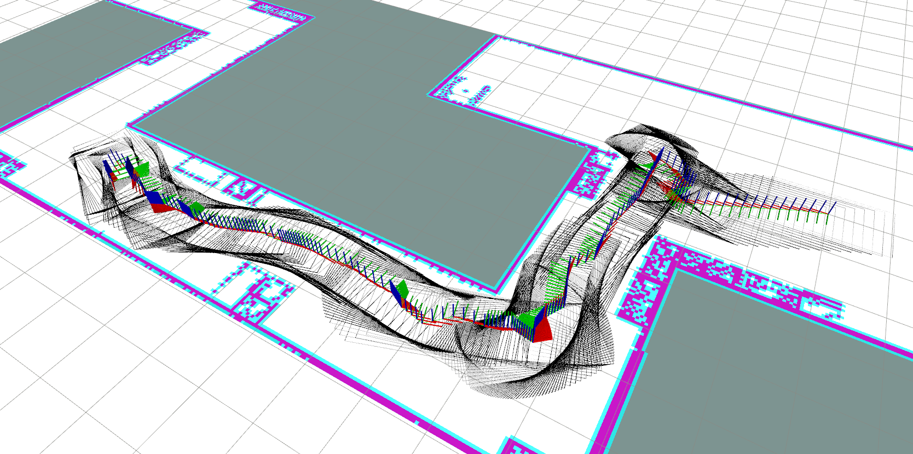

# Path planner for Self-Reconfigurable Robots

## Overview

***psrr*** is a collection of open source ROS packages for path planning of self-reconfigurable robots in constrained areas. We focus on pure geometric path planning for now and currenly only support planar-type self-reconfigurable robots with n-dimensional joints (**SE**(2) + **R**^n) and footprint-based 2D collision checking. This is currently an ongoing work and many more packages will be added to the repository to enable fully autonomous navigation for any general self-reconfigurable robots.



## ROS Nodelets

### psrr_planner/PsrrPlannerNodelet

This nodelet uses [ompl](https://ompl.kavrakilab.org/) sampling-based planning algorithms to find n-dimensional geometric solution paths of the self-reconfigurable robots. Refer to [this](https://github.com/roarLab/psrr/tree/master/psrr_planner/README.md) for more information of the nodelet.

## Installation

### Build from source

Clone this package into your src folder of catkin_workspace:
```
cd <yr_catkin_ws>/src
git clone https://github.com/roarLab/psrr.git
```

Install necessary dependencies by running the following command in the root of your workspace:
```
cd ..
rosdep install -y --from-paths src --ignore-src --rosdistro <YOUR_ROS_DISTRO>
```

Then compile with catkin:
```
catkin_make
```
