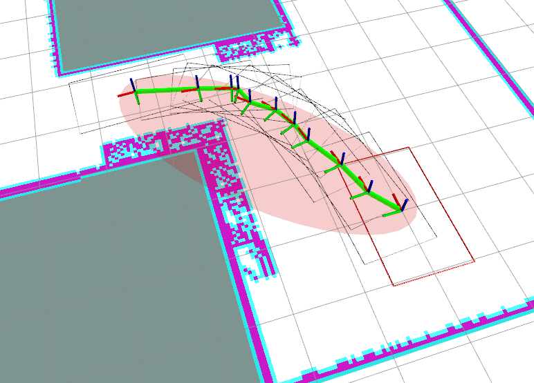

# Path planner for Self-Reconfigurable Robots

***psrr*** is a collection of open source ROS packages for path planning of self-reconfigurable robots in constrained areas. We focus on pure geometric path planning for now and currenly only support planar-type self-reconfigurable robots with n-dimensional joints (SE(2) + R^n) and footprint-based 2D collision checking. This is currently an ongoing work and many more packages will be added to the repository to enable fully autonomous navigation for any general self-reconfigurable robots.

